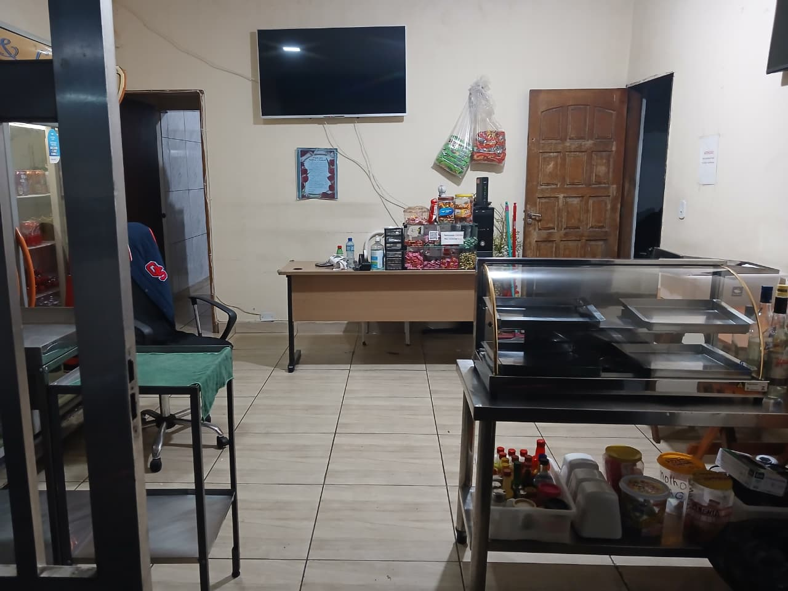

# Entrega 1 — Modelo Conceitual (DER)
### Modelagem de um sistema de gestão de informações para uma organização de pequeno porte

> Este arquivo é o esqueleto do **README.md** do repositório GitHub do seu grupo.
> Preencha cada seção abaixo. Não apague os títulos — apenas substitua as instruções em *itálico* pelo conteúdo do seu projeto.
> O **DER** é anexado separadamente ao repositório (em imagem), mas sua justificativa entra neste README.
>
> **A organização escolhida pode ser de qualquer natureza:** empresa com fins lucrativos (livraria, restaurante, pet shop), ONG, associação comunitária, cooperativa, instituições religiosas/comunitárias como igrejas, terreiros de religiões de matriz africana (candomblé, umbanda) ou outras. O que muda de um tipo para outro são os processos e as regras específicas — a estrutura do trabalho (levantamento de requisitos, modelagem conceitual, DER) é a mesma para todas. Termos como "empresa" e "negócio" usados abaixo devem ser lidos de forma ampla, no sentido técnico de modelagem de dados (ex.: "regras de negócio" = regras de funcionamento da organização, seja ela comercial, religiosa ou social).
>
> **Importante:** a organização precisa **existir de fato** — não é permitido inventar uma organização fictícia. O levantamento de requisitos e regras de negócio deve ser feito por meio de **pesquisa de campo na própria organização** (visitas, entrevistas com responsáveis, observação dos processos reais), então o grupo só deve escolher uma organização à qual **realmente tenha acesso**. Ao escolher, tomem cuidado com o porte: **nem tão pequena** que não gere dados suficiente para o trabalho (poucos processos, poucas entidades), **nem tão grande/complexa** que fique inviável de modelar nesta primeira etapa do curso.

---

## Metadados

- *Alessa Araújo Ctvrtnik
   
RGM: 49508610*
- *João Vitor Mendes Almeida
   
RGM: 49744453*
- *Matheus Ferreira da Silva
   
RGM: 47903520*
- *Otávio Teixeira Lopes da Silva
   
RGM: 47880414*
- *Paulo Sergio Olivastro
   
RGM: 47962241*

## 1. Caracterização da Organização
*(vale 7,5% — Dimensão Conceitual)*

- **Nome e natureza da organização:** Estabelecimento comercial familiar de pequeno porte que vende refeições completas (prato feito), bebidas e frango assado com acompanhamentos. Seu modelo de negócio combina restaurante de prato feito e frangueria. **Nome oficial do estabelecimento:** A Frangueria - Restaurante.
- **Contexto e porte:** Microempresa com fins lucrativos, voltada à geração legítima de renda e à sustentabilidade do negócio. A operação é compacta e direcionada ao consumidor final. Não há funcionários terceirizados, prestadores de serviço externos ou voluntários; gestão, cozinha e atendimento são realizados colaborativamente pela própria família. O estabelecimento funciona aos sábados e domingos, das 10h às 20h, com produção concentrada e alto volume de atividade nesses dias.
- **Problemas e necessidades identificados:** A organização não oferece entrega em domicílio. Isso limita o alcance geográfico, reduz oportunidades de faturamento e restringe o atendimento a consumidores que preferem receber os pedidos em casa. Na operação atual, os pedidos são anotados em uma caderneta, e a disponibilidade dos produtos é conferida pela família antes da confirmação.
- **Justificativa da escolha:** A escolha do estabelecimento fundamenta-se em três critérios. O primeiro é o acesso garantido à organização: um dos integrantes do grupo possui vínculo direto com os proprietários, o que viabiliza visitas, entrevistas e observação da rotina operacional. O segundo é o porte compatível com o escopo da disciplina: trata-se de microempresa familiar, com funcionamento aos sábados e domingos, das 10h às 20h, cuja operação enxuta permite mapear todos os processos sem a complexidade de organizações de maior porte, mantendo volume suficiente de dados para modelagem. O terceiro é o modelo de negócio misto, que combina restaurante de prato feito e frangueria, exigindo entidades específicas para controle de produção por lote e encomendas antecipadas, o que amplia a riqueza do exercício de modelagem.

- **Evidências da organização:** A existência e o acesso à organização são comprovados pelos registros abaixo.

- **Link público no Google Maps (Google Meu Negócio):**
https://maps.app.goo.gl/pjqxhT2Ltq6g1c2D7?g_st=ac

- **Foto do local e da visita:**

---

## 2. Processos de Negócio
*(vale 10% — Dimensão Procedimental)*

- **Principais processos mapeados e representados no DER:**
  - **Cadastro de pessoas e clientes:** são mantidos dados cadastrais de pessoas; quando a pessoa atua como cliente, há também registro de cliente. O cliente pode possuir telefones de contato.
  - **Atendimento e registro do pedido:** o funcionário (membro da família que opera o sistema) registra o pedido, sua data e hora de abertura, modalidade e identificador de mesa quando aplicável. O pedido é associado ao cliente.
  - **Composição do pedido:** cada pedido contém itens; cada item registra quantidade, valor aplicado e observação e se relaciona a um produto disponível no cardápio.
  - **Reserva de mesa:** o cliente agenda reserva com data e hora, quantidade de pessoas e situação.
  - **Encomenda antecipada de frango:** o pedido pode originar uma reserva de frango, com quantidade reservada, horário de retirada e situação. A reserva é atendida a partir de lote da frangueria.
  - **Registro financeiro:** o pedido possui registro de faturamento com data do pagamento, valor total, forma de pagamento e situação. São aceitos dinheiro, Pix e cartão; dados do cartão não são armazenados.
  - **Preparo, retirada e encerramento:** os itens são preparados conforme a ordem de recebimento e capacidade da equipe. Pedidos de retirada são identificados e avisados ao cliente por telefone quando prontos. O atendimento é encerrado após a entrega/serviço e o registro financeiro correspondente.
- **Fluxogramas:** A organização optou por não inserir o fluxograma.

---

## 3. Requisitos do Sistema
*(esta seção e a Seção 4 "Regras de Negócio" DIVIDEM 7,5% na dimensão conceitual — juntas valem 7,5%, não 7,5% cada — + 4% exclusivos desta seção na organização/documentação)*

### 3.1 Requisitos Funcionais
| Código | Requisito funcional |
|--------|---------------------|
| RF01 | Cadastrar produtos do cardápio com nome, descrição, preço, categoria e disponibilidade. |
| RF02 | Cadastrar pessoas e clientes, mantendo os dados cadastrais indicados no DER. |
| RF03 | Registrar um ou mais telefones associados à pessoa, com número e tipo. |
| RF04 | Cadastrar funcionários que operam o sistema, com cargo, salário-base e situação. |
| RF05 | Registrar pedidos com data e hora de abertura, tipo de consumo e identificador de mesa quando aplicável. |
| RF06 | Associar o pedido ao cliente e ao funcionário responsável pelo registro. |
| RF07 | Incluir no pedido os itens, com quantidade, valor aplicado e observação, cada qual relacionado a um produto. |
| RF08 | Registrar reservas de mesa vinculadas ao cliente, com data e hora, quantidade de pessoas e situação. |
| RF09 | Registrar reserva antecipada de frango originada do pedido, com quantidade reservada, horário de retirada e situação, e associá-la ao lote que a atende. |
| RF10 | Registrar o faturamento associado ao pedido, com data do pagamento, valor total, forma e situação. |
| RF11 | Consultar pedidos, reservas, disponibilidade de produtos e informações financeiras por seus dados de identificação e situação. |
| RF12 | Acompanhar as situações de pedidos, reservas e faturamentos até a conclusão de cada atendimento. |

### 3.2 Requisitos Não Funcionais
| Código | Requisito não funcional |
|--------|--------------------------|
| RNF01 - Usabilidade | A tela de registro deve ser simples e utilizável pelos membros da família sem treinamento técnico. |
| RNF02 - Rapidez | As operações de consulta e gravação devem responder em até 3 segundos em condições normais de uso. |
| RNF03 - Acesso | O sistema deve funcionar em computador, tablet ou celular disponível no restaurante. |
| RNF04 - Segurança | O acesso deve ser restrito aos membros da família autorizados, por autenticação individual. |
| RNF05 - Privacidade | Devem ser coletados somente dados pessoais necessários à operação. Não se armazenam dados de cartão. O CPF, e-mail e data de nascimento constantes no DER devem ser confirmados como necessários antes da implementação. |
| RNF06 - Integridade | Pessoas, clientes, telefones, pedidos, itens, produtos, reservas, lotes e faturamentos devem manter suas associações válidas. |
| RNF07 - Cópia de segurança | Os registros devem ter cópia de segurança diária para recuperação em caso de falha. |
| RNF08 - Disponibilidade | O sistema deve estar disponível durante o atendimento informado, aos sábados e domingos, das 10h às 20h. |

---

## 4. Regras de Negócio
*(esta seção DIVIDE com a Seção 3 "Requisitos do Sistema" os mesmos 7,5% da dimensão conceitual — juntas valem 7,5%, não 7,5% cada — + 4% exclusivos desta seção na documentação. "Regras de negócio" é o termo técnico usado em modelagem de dados para as regras de funcionamento de qualquer organização, com ou sem fins lucrativos)*

- **Regras operacionais:**
  - **RN01:** O atendimento ao público ocorre aos sábados e domingos, das 10h às 20h.
  - **RN02:** Cada pedido deve registrar tipo de consumo; o identificador de mesa é aplicável ao consumo no local. Para retirada, deve haver telefone de contato disponível para o aviso de pedido pronto.
  - **RN03:** O cliente deve estar associado a uma pessoa cadastrada; uma pessoa pode possuir telefones cadastrados conforme a necessidade de contato.
  - **RN04:** Cada pedido é registrado por um funcionário (neste contexto, membro da família autorizado a operar o sistema).
  - **RN05:** Um pedido é composto por itens relacionados a produtos do cardápio. Cada item registra quantidade, valor aplicado e, quando necessário, observação.
  - **RN06:** A disponibilidade dos produtos deve ser conferida com a equipe antes da confirmação. A indisponibilidade leva à substituição ou remoção do item conforme escolha do cliente.
  - **RN07:** O pedido confirmado deve conter ao menos um item e cada quantidade deve ser maior que zero.
  - **RN08:** O cliente pode agendar reserva de mesa; a reserva registra data e hora, quantidade de pessoas e situação.
  - **RN09:** A encomenda antecipada de frango é registrada como reserva de frango derivada de pedido e contém quantidade reservada, horário de retirada e situação.
  - **RN10:** Cada reserva de frango deve ser atendida por lote(s) da frangueria; a disponibilidade deve ser verificada pela equipe. O DER precisa explicitar a cardinalidade pretendida entre reserva e lote e a quantidade fornecida por lote, caso uma reserva possa consumir mais de um lote.
  - **RN11:** O pedido deve possuir registro de faturamento com data de pagamento, valor total, forma de pagamento e situação. São aceitos dinheiro, Pix e cartão; dados do cartão não devem ser armazenados.
  - **RN12:** O pedido só é encerrado após ser servido ou retirado e o registro financeiro ser realizado.
  - **RN13:** Alterações ou cancelamentos devem ser comunicados à equipe responsável e refletidos na situação do pedido ou reserva correspondente.
  - **RN14:** A organização não realiza entrega domiciliar; os pedidos são consumidos no local ou retirados pelo cliente.
- **Restrições organizacionais:**
  - **Equipe familiar reduzida:** os registros de funcionário correspondem aos membros da família autorizados; não há terceirizados ou voluntários segundo o contexto informado.
  - **Operação somente aos fins de semana:** o funcionamento informado é sábado e domingo, das 10h às 20h.
  - **Dados pessoais mínimos:** o DER apresenta CPF, e-mail e data de nascimento em Pessoa, além de telefone. Esses dados ampliam a coleta descrita inicialmente e só devem ser mantidos se a pesquisa de campo confirmar necessidade e finalidade. Não incluir dados reais nos exemplos.
  - **Registro atual em caderneta:** o sistema proposto deve ser simples e adequado à rotina familiar.
  - **Sem baixa automática de ingredientes:** a disponibilidade de produtos/lotes é confirmada pela equipe; o modelo não implica controle de ingredientes nem movimentação automatizada de estoque.
  - **Escopo das reservas:** reservas de mesa e encomendas antecipadas de frango passam a integrar o escopo porque constam no DER; o grupo deve confirmar em pesquisa de campo que esses processos realmente ocorrem na organização.

---

## 5. Dicionário de Dados Conceitual (Preliminar)
*(vale 10% — Dimensão Procedimental - Segue o modelo do arquivo 02-03g_Exemplo_Dicionario_Dados.pdf)*

Abaixo estão as entidades e os atributos que aparecem no DER fornecido. Os identificadores são considerados chaves primárias; atributos `id_*` que apontam para outra entidade são referências (chaves estrangeiras) e devem ser mostrados como relacionamentos no modelo conceitual.

**Entidade: Pessoa**

| Atributo | Descrição | Regra de negócio associada |
|----------|-----------|------------------------------|
| id_pessoa | Identificador da pessoa. | Deve identificar unicamente cada pessoa. |
| nome | Nome da pessoa. | Necessário para identificação. |

**Entidade: Cliente**

| Atributo | Descrição | Regra de negócio associada |
|----------|-----------|------------------------------|
| id_cliente | Identificador do cliente. | Deve identificar unicamente cada cliente. |
| data_cadastro | Data de cadastro do cliente. | Registrar quando o cliente for incluído. |

**Entidade: Funcionário**

| Atributo | Descrição | Regra de negócio associada |
|----------|-----------|------------------------------|
| id_funcionario | Identificador do funcionário. | Deve identificar unicamente cada operador cadastrado. |
| cargo | Função exercida. | Deve refletir a função na organização. |
| salario_base | Salário-base registrado. | Dado restrito; confirmar se é necessário ao sistema proposto. |
| status | Situação do cadastro/atividade. | Deve indicar se o funcionário está ativo ou inativo. |

**Entidade: Telefone**

| Atributo | Descrição | Regra de negócio associada |
|----------|-----------|------------------------------|
| id_telefone | Identificador do telefone. | Deve identificar unicamente cada registro de telefone. |
| numero | Número de telefone. | Usado para contato quando necessário, especialmente em retirada. |
| tipo_telefone | Classificação do telefone. | Deve indicar o tipo adotado pela organização. |
| id_pessoa | Pessoa proprietária do telefone. | Deve referenciar uma Pessoa existente. |

**Entidade: Pedido**

| Atributo | Descrição | Regra de negócio associada |
|----------|-----------|------------------------------|
| id_pedido | Identificador do pedido. | Deve identificar unicamente cada pedido. |
| data_hora_abertura | Data e hora da abertura. | Registrar no momento da criação. |
| tipo_consumo | Modalidade de atendimento. | Indicar consumo no local ou retirada. |
| identificador_mesa | Mesa associada ao pedido. | Aplicável ao consumo no local; não se aplica à retirada. |
| status | Situação atual do pedido. | Deve registrar o histórico de estados do pedido. |

**Entidade: Item_pedido**

| Atributo | Descrição | Regra de negócio associada |
|----------|-----------|------------------------------|
| id_item | Identificador do item do pedido. | Deve identificar unicamente cada item. |
| quantidade | Quantidade do produto solicitado. | Deve ser maior que zero. |
| valor_aplicado | Valor aplicado ao item no momento do pedido. | Deve permitir preservar o valor praticado na transação. |
| observacao | Observação específica do item. | Opcional, quando houver instruções para o preparo. |

**Entidade: Produto**

| Atributo | Descrição | Regra de negócio associada |
|----------|-----------|------------------------------|
| id_produto | Identificador do produto. | Deve identificar unicamente cada produto. |
| nome | Nome do item do cardápio. | Obrigatório para identificação. |
| descricao | Descrição do produto. | Descrever o item quando necessário. |
| preco | Preço de venda vigente. | Deve estar informado para venda. |
| categoria | Categoria do cardápio. | Deve corresponder a uma categoria utilizada pela organização. |
| disponibilidade | Situação de disponibilidade do produto. | Deve ser conferida com a equipe; não implica baixa automática de ingredientes. |

**Entidade: Reserva_mesa**

| Atributo | Descrição | Regra de negócio associada |
|----------|-----------|------------------------------|
| id_reserva | Identificador da reserva de mesa. | Deve identificar unicamente cada reserva. |
| data_hora | Data e hora agendadas. | Devem ser registradas para organizar o atendimento. |
| qnt_pessoas | Quantidade de pessoas. | Deve ser maior que zero. |
| status | Situação da reserva. | Indicar o estado adotado pela organização. |

**Entidade: Reserva_frango**

| Atributo | Descrição | Regra de negócio associada |
|----------|-----------|------------------------------|
| id_reserva_frango | Identificador da reserva de frango. | Deve identificar unicamente cada encomenda antecipada. |
| qnt_reservada | Quantidade reservada. | Deve ser maior que zero e compatível com a disponibilidade. |
| horario_retirada | Horário previsto para retirada. | Deve ser registrado para organizar a entrega ao cliente no local. |
| status | Situação da reserva. | Indicar o estado adotado pela organização. |

**Entidade: Lote_frangueria**

| Atributo | Descrição | Regra de negócio associada |
|----------|-----------|------------------------------|
| id_produto | Identificador exibido no DER para o lote/produto. | Confirmar o nome e a função: não deve colidir com a chave `id_produto` da entidade Produto. Recomenda-se identificador próprio, como `id_lote`. |
| nome | Nome do item/lote. | Identificar o lote ou produto da frangueria. |
| descricao | Descrição do lote/item. | Complementar a identificação, se necessário. |
| preco | Preço associado. | Esclarecer se é preço unitário ou do lote. |
| categoria | Categoria do item. | Deve corresponder a uma categoria utilizada pela organização. |
| disponibilidade | Situação de disponibilidade do lote. | Conferida pela equipe; definir como a quantidade restante será controlada. |

**Entidade: Faturamento**

| Atributo | Descrição | Regra de negócio associada |
|----------|-----------|------------------------------|
| id_faturamento | Identificador do registro financeiro. | Deve identificar unicamente cada registro. |
| data_pagamento | Data do pagamento. | Registrar quando o pagamento ocorrer. |
| valor_total | Valor total registrado. | Deve corresponder ao valor devido pelo pedido, conforme regra adotada. |
| forma_pagamento | Meio utilizado para pagar. | Valores aceitos: dinheiro, Pix ou cartão; não armazenar dados do cartão. |
| status | Situação do faturamento. | Indicar se está pendente, pago, estornado ou outra situação definida pela organização. |

---

## 6. Modelagem Conceitual (Entidades, Atributos, Relacionamentos)
*(vale 7,5% na dimensão conceitual)*

### Entidades reconhecidas

- **Pessoa:** mantém os dados cadastrais comuns usados pelo diagrama.
- **Cliente:** representa a pessoa no papel de consumidor e concentra a data de cadastro.
- **Funcionário:** representa o membro da família que atende e registra pedidos. Não implica contratação externa; cargo, situação e salário-base constam no DER, embora a necessidade de armazenar salário deva ser validada.
- **Telefone:** permite registrar contatos associados à pessoa.
- **Pedido:** representa uma solicitação de consumo local ou retirada.
- **Item_pedido:** entidade associativa que registra cada linha de produto solicitada e seus dados próprios.
- **Produto:** representa os itens disponíveis no cardápio.
- **Faturamento:** registra os dados financeiros vinculados ao pedido.
- **Reserva_mesa:** registra o agendamento de atendimento de mesa.
- **Reserva_frango:** representa a encomenda antecipada de frango assado derivada de pedido.
- **Lote_frangueria:** representa o lote/registro de disponibilidade usado para atender reservas de frango.

### Atributos e classificações

Os atributos identificadores são as chaves primárias indicadas pelo ponto preenchido no DER. Os atributos que ligam entidades devem ser implementados como referências relacionais; em um DER conceitual, a ligação é representada pelo relacionamento correspondente.

| Entidade | Atributos do DER |
|----------|------------------|
| Pessoa | `id_pessoa` (identificador), `nome` (descritivos/cadastrais). |
| Cliente | `id_cliente` (identificador), `data_cadastro` (cadastral). |
| Funcionário | `id_funcionario` (identificador), `cargo`, `salario_base`, `status` (cadastrais/operacionais). |
| Telefone | `id_telefone` (identificador), `numero`, `tipo_telefone`, `id_pessoa` (referência a Pessoa). |
| Pedido | `id_pedido` (identificador), `data_hora_abertura`, `tipo_consumo`, `identificador_mesa`, `status` (operacionais). |
| Item_pedido | `id_item` (identificador), `quantidade`, `valor_aplicado`, `observacao` (atributos da linha do pedido). |
| Produto | `id_produto` (identificador), `nome`, `descricao`, `preco`, `categoria`, `disponibilidade` (cadastrais/operacionais). |
| Reserva_mesa | `id_reserva` (identificador), `data_hora`, `qnt_pessoas`, `status` (operacionais). |
| Reserva_frango | `id_reserva_frango` (identificador), `qnt_reservada`, `horario_retirada`, `status` (operacionais). |
| Lote_frangueria | `id_produto` (identificador como está desenhado; recomenda-se renomear para `id_lote`), `nome`, `descricao`, `preco`, `categoria`, `disponibilidade`. |
| Faturamento | `id_faturamento` (identificador), `data_pagamento`, `valor_total`, `forma_pagamento`, `status` (financeiros/operacionais). |

### Relacionamentos e cardinalidades representados

A notação do diagrama mostra mínimos e máximos junto às linhas. A leitura abaixo acompanha os rótulos e cardinalidades visíveis; algumas associações precisam ser revistas para evitar cardinalidades obrigatórias inconsistentes com o fluxo real.

- **Pessoa possui Telefone:** o diagrama indica (1,n) junto a Pessoa e (0,n) junto a Telefone. A leitura pretendida parece ser uma Pessoa possuir zero ou muitos telefones e cada Telefone pertencer a uma Pessoa; recomenda-se corrigir a cardinalidade do lado de Telefone para (1,1), pois um registro de telefone não deve ficar sem pessoa.
- **Pessoa relaciona-se com Cliente:** o DER indica (1,n) nos dois lados. Isso permitiria vários vínculos em ambos os sentidos; se Cliente for uma especialização de Pessoa, a cardinalidade adequada costuma ser Pessoa (0,1) Cliente e Cliente (1,1) Pessoa. O grupo deve escolher entre especialização e relacionamento e ajustar o desenho, evitando a relação genérica ambígua.
- **Cliente agenda Reserva_mesa:** o diagrama indica (1,n) para Cliente e (0,n) para Reserva_mesa. Para permitir clientes sem reservas e exigir que cada reserva tenha um cliente, recomenda-se Cliente (0,n) e Reserva_mesa (1,1).
- **Cliente realiza Pedido:** o diagrama indica (1,n) em ambos os lados. Para permitir cadastro de clientes sem pedidos e exigir um cliente em cada pedido, recomenda-se Cliente (0,n) e Pedido (1,1).
- **Funcionário registra Pedido:** o desenho associa funcionário e pedido pelo relacionamento “registra” e mostra (1,n) nos dois lados. A regra de registro sugere Funcionário (0,n) Pedido e Pedido (1,1) Funcionário, salvo se a pesquisa confirmar que pedidos podem ser registrados por mais de um funcionário.
- **Pedido contém Item_pedido:** o diagrama indica (1,n) dos dois lados. A regra natural é Pedido (1,n) Item_pedido e Item_pedido (1,1) Pedido. Cada item pertence a um único pedido.
- **Item_pedido relaciona-se com Produto:** o desenho indica (1,n) nas duas pontas. A regra pretendida é Item_pedido (1,1) Produto e Produto (0,n) Item_pedido: cada linha identifica um produto, que pode aparecer em muitos pedidos ou ainda não ter sido vendido.
- **Pedido possui Faturamento:** o desenho indica (1,n) em ambos os lados. Se houver um único registro consolidado por pedido, usar Pedido (0,1) Faturamento e Faturamento (1,1) Pedido. Se houver pagamentos parciais ou parcelas, a cardinalidade pode ser Pedido (0,n) Faturamento e deve ser acompanhada por valores por pagamento.
- **Pedido deriva Reserva_frango:** o diagrama indica (1,n) nas duas pontas. Se a reserva for um detalhe opcional de um pedido, usar Pedido (0,1) Reserva_frango e Reserva_frango (1,1) Pedido; se um pedido puder conter várias reservas, ajustar conforme o processo observado.
- **Reserva_frango fornece-se por Lote_frangueria:** o desenho mostra (1,n) dos dois lados. A cardinalidade deve refletir a operação real: uma reserva pode consumir um ou mais lotes, e um lote pode atender várias reservas; se quantidades forem alocadas por lote, o relacionamento precisa de atributo associativo `quantidade_fornecida`.
- **Pessoa e Funcionário:** o diagrama os relaciona pela relação “gera”, com (1,n) nos dois lados. O significado precisa ser definido. Se funcionário for papel/subtipo de Pessoa, prefira especialização Pessoa–Funcionário com correspondência 1:1; “gera” não deixa claro o vínculo de cadastro.

### Restrições e políticas organizacionais aplicadas ao modelo

- Tipo de consumo deve indicar local ou retirada; mesa aplica-se ao consumo local. Para retirada, deve existir telefone de contato associado à pessoa/cliente.
- A equipe confere a disponibilidade de produto antes de confirmar o pedido. Quantidade de item e quantidade reservada devem ser positivas.
- Valor aplicado no item preserva o preço usado naquela venda, mesmo que o preço cadastrado do produto mude posteriormente.
- Reservas de mesa e reservas antecipadas de frango estão incluídas porque aparecem no DER; validar por pesquisa de campo que ambos os processos são reais e definir estados válidos.
- O faturamento registra forma, data, valor e situação sem armazenar dados de cartão. Definir se há um ou vários faturamentos por pedido.
- Dados como CPF, e-mail, data de nascimento e salário-base devem ter finalidade confirmada e acesso restrito; remover do modelo se não forem necessários ao processo pesquisado.
- O DER deve corrigir identificadores duplicados ou ambíguos, em especial `id_produto` usado também em Lote_frangueria, e explicitar as chaves que hoje aparecem apenas como linhas de relacionamento.
- O negócio não oferece delivery; não se deve introduzir endereço de entrega. A disponibilidade de lotes não representa, por si só, controle automatizado de estoque.

---

## 7. Diagrama Entidade-Relacionamento (DER)
*(vale 20% — é o item de maior peso da entrega)*

- O diagrama inclui Pessoa, Cliente, Funcionário, Telefone, Pedido, Item_pedido, Produto, Faturamento, Reserva_mesa, Reserva_frango e Lote_frangueria.

---

## 8. Justificativa Técnica
*(vale 7,5% — sozinho, é o subcritério de maior peso dentro da Dimensão Conceitual)*

O modelo separa os conceitos que têm identidade e ciclo próprios. Pessoa concentra os dados cadastrais, enquanto Cliente representa seu papel nas compras; Funcionário identifica o operador que registra pedidos. Telefone foi separado para permitir mais de um contato por pessoa. Pedido é a transação principal, e Item_pedido resolve a relação muitos-para-muitos entre pedido e produto, além de guardar quantidade, valor aplicado e observação por item. Produto mantém o catálogo e a disponibilidade. Faturamento separa o registro financeiro do atendimento. Reserva_mesa e Reserva_frango representam dois processos específicos mostrados no DER, e Lote_frangueria permite relacionar as encomendas antecipadas à produção disponível.

As cardinalidades devem refletir a ocorrência mínima e máxima real, não simplesmente repetir (1,n) em todas as linhas. Em particular, cliente e produto podem existir sem pedido/venda; um pedido deve possuir itens e estar associado ao cliente e ao funcionário que o registrou; um item pertence a um pedido e referencia um produto. O vínculo entre pedido e faturamento depende de a organização registrar um pagamento consolidado ou vários pagamentos. A associação entre reserva de frango e lote depende de como a produção é separada; se vários lotes atenderem uma reserva, a quantidade fornecida em cada associação precisa ser registrada.

A decomposição evita repetir dados do produto em cada pedido e permite preservar o valor aplicado no momento da venda. A separação Pessoa–Cliente e Pessoa–Funcionário facilita distinguir dados cadastrais de papéis, mas o DER deve representá-la como especialização ou vínculo 1:1 claramente definido. A modelagem inclui reservas e cadastro pessoal adicional porque aparecem no diagrama recebido; a pesquisa de campo deve confirmar que esses processos e dados existem e são necessários. CPF, e-mail, data de nascimento e salário-base não devem ser coletados sem finalidade operacional definida. A ausência de entidade de entrega é coerente com a regra de que o estabelecimento não oferece delivery.

---
## 9. Uso de Inteligência Artificial

O grupo utilizou o ChatGPT como apoio para *organizar e revisar a documentação do trabalho*, e não como fonte principal de informações sobre a organização. As informações sobre o funcionamento do estabelecimento e os seus processos foram confirmadas pelo grupo por meio da pesquisa de campo.

- *Ferramenta e etapa:* ChatGPT, Gemini e DeepSeek na organização e revisão do texto do README e na elaboração desta seção.
- *Motivação:* melhorar a clareza e a organização da documentação e atender aos itens solicitados no roteiro.
- *Prompt utilizado, em formulação aproximada:* “Ajude a organizar e revisar o texto do trabalho, mantendo as informações fornecidas pelo grupo. Não invente dados sobre a organização e indique o que precisa ser confirmado pela pesquisa de campo.”
- *Resposta recebida:* sugestões de estrutura e redação para apresentar os processos, requisitos e regras de negócio, além de apontamentos sobre dados e relações do modelo que precisam ser confirmados.
- *Fontes consultadas e verificadas:* Nenhuma foi utilizada como fonte de dados sobre a organização. As informações factuais devem ser verificadas pelo grupo com os responsáveis, durante a visita ou entrevista, e comparadas com a observação da rotina do estabelecimento. Não considerar sugestões da IA como confirmação de fatos.
- *Trechos rejeitados ou corrigidos:* afirmações ou detalhes que não correspondessem ao que o grupo observou ou ouviu devem ser removidos ou corrigidos. Também devem ser revisados os pontos que o próprio documento indica como pendentes de confirmação, como a existência de reservas de mesa e de frango, a necessidade de coletar dados pessoais e as cardinalidades do DER.
- *Justificativa da escolha final:* o grupo aproveitou a IA como apoio de redação e organização, mantendo no trabalho apenas informações que consiga validar. As decisões sobre os processos reais e o modelo devem ser tomadas pelo grupo com base na pesquisa de campo.
- *Reflexão crítica:* a IA pode produzir texto claro e convincente mesmo quando não conhece a realidade específica da organização. Também pode sugerir regras ou estruturas genéricas que não se aplicam ao estabelecimento. Por isso, suas respostas foram tratadas como sugestões, e não como evidências; cabe ao grupo conferir os fatos e revisar o conteúdo antes da entrega.

---

## Critérios Atitudinais (20%)
**Estes critérios NÃO constam explicitamente como item de entrega no README.** Eles são avaliados por meio de **Avaliação 360º entre os integrantes do grupo** (cada membro avalia os colegas de equipe) e, no caso da Colaboração, também pela **colaboração equilibrada no histórico de commits** do repositório GitHub — não pela leitura do restante do repositório nem pela apresentação:

- **Participação (5%):** envolvimento nas discussões técnicas e nas decisões do grupo.
- **Comprometimento (5%):** cumprimento de prazos e responsabilidades assumidas.
- **Colaboração (5%):** respeito às contribuições dos colegas, cooperação na construção do projeto e colaboração equilibrada no histórico de commits do repositório GitHub.
- **Autonomia (5%):** busca independente de soluções e proposta de melhorias.

---

## Resumo dos Pesos

| Dimensão | Peso total |
|----------|-----------|
| Conceitual (contexto, requisitos/regras, modelagem, justificativa técnica) | 30% |
| Procedimental (requisitos, fluxogramas, dicionário de dados, DER) | 50% |
| Atitudinal (participação, comprometimento, colaboração, autonomia) | 20% |

**Entrega final:** README.md completo + DER + Dicionário de Dados em HTML (com exceção dos cursos GTI) anexado no repositório GitHub do grupo.

